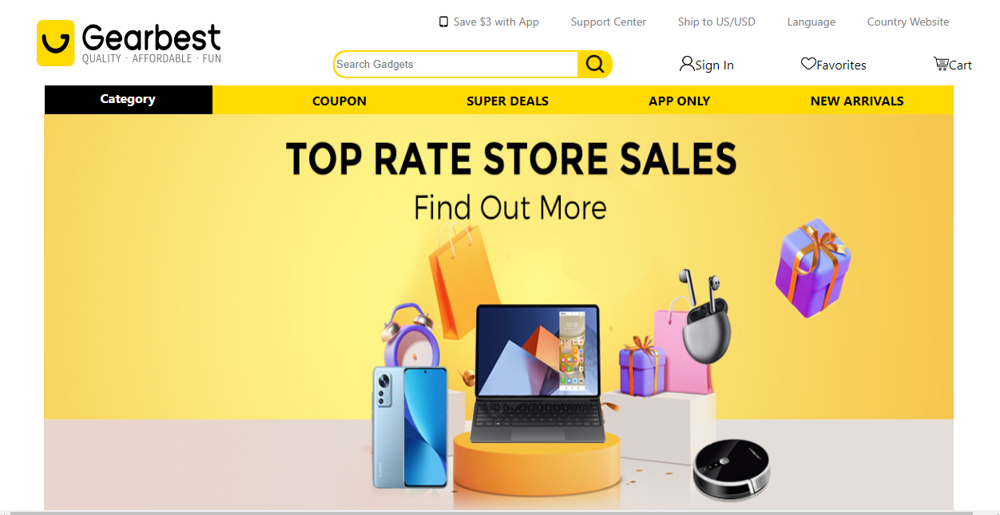

<h1>Gearbest Clone</h1>

Hey👋, this is the cloning of one of the popular gadgets products website named “Gearbest.com”. This project was assigned to us in Unit 5 construct week in Masai School. Gearbest offers customers services they won’t find anywhere else, all available to browse on practically in any device.

<h3>Deploy Link : </h3>
<a href="https://gearbestclonemasai.netlify.app/">
gearbestclonemasai.netlify.app/ </a>
<h3>Medium Link : </h3>
<a href="https://medium.com/@rupamshw77777/gearbest-clone-bcbe935e558d">
medium.com/@rupamshw77777/gearbest-clone-bcbe935e558d </a>
<h3>Team Members:</h3>

<a href="https://github.com/snehanaik4737">Sneha</a> | <a href="https://github.com/ShaikHajira123">Hajira</a> | <a href="https://github.com/Bvaishnavi123">Vaishnavi</a> | <a href="https://github.com/rupamShaw1998">Rupam</a> | <a href="https://github.com/Sumitnarwal">Sumit</a>

<h3>Tech Stack:</h3>

HTML | CSS | JavaScript | MERN | Redux | Material UI

<h3>Landing Page:</h3>

<h4>We used the following resources:</h4>

⬤ https://stackoverflow.com

⬤ https://w3schools.com

⬤ https://mdn.com

Github link: https://github.com/rupamShaw1998/GearBest

<h3>Thank You</h3>
